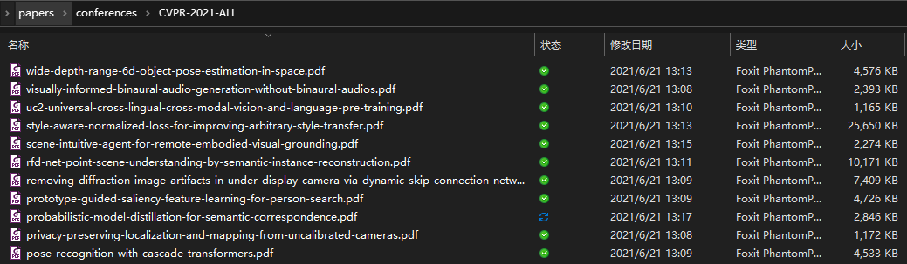
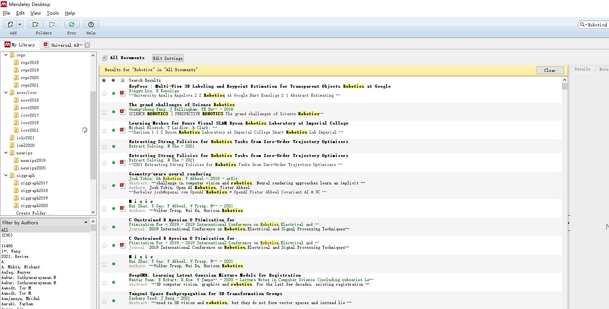

# Crawling-CV-Conference-Papers

## News

- ***2021-11-25*** - Support ***NeurIPS-2021***

Set the local download directory in [download_neurips2021.py](./download_neurips2021.ipynb) and run it! Or you can directly download pdf files in my [OneDrive link](https://1drv.ms/u/s!Ajsnj0gOimMfh4hoLbf317Dw_RrFTQ?e=TjKBhC).

- ***2021-10-13*** - Support ***ICCV-2021***

Set the local download directory in [download_iccv2021.py](./download_iccv2021.py) and run it! Or you can directly download pdf files in my [OneDrive link](https://1drv.ms/u/s!Ajsnj0gOimMfh4hoLbf317Dw_RrFTQ?e=TjKBhC).

- ***2021-6-21*** - ***Important!*** Direct download [link](https://1drv.ms/u/s!Ajsnj0gOimMfh4hoLbf317Dw_RrFTQ?e=TjKBhC) available!

To lower the barriers for those who do not want to mess with code and git, the direct download [link](https://1drv.ms/u/s!Ajsnj0gOimMfh4hoLbf317Dw_RrFTQ?e=TjKBhC) from OneDrive for recent CV/DL conference papers is provided! Click and check! (Though older conferences downloading still require mannually running the code)

- ***2021-6-21*** - Support ***CVPR-2021***

Download all ***CVPR-2021*** papers in one click. Just set the local download directory in [download_cvpr2021.py](./download_cvpr2021.py) and run it! Don't forget to have your chrome driver ready (i.e., corresponding version to your Chrome browser)



- ***2021-6-20*** - Support continuation of downloading from where the program encounters interruption. (prevent re-downloading from scratch)

## Introduction

Python code to crawl computer vision papers from top CV conferences. Currently it supports CVPR, ICCV, ECCV, NeurIPS, ICML, ICLR, SIGGRAPH. It leverages [selenium](https://www.selenium.dev/), a website testing framework to crawl the titles and pdf urls from the conference website, and download them one by one with some simple anti-anti-crawler tricks.

Websites for older conferences are not guaranteed to be bug-free, since this project is based on newest website structure.

***Recommend to work with [Mendeley](https://www.mendeley.com/download-desktop-new/). You will get a juicy academic corpus.***



Currently only single-thread downloading is implemented. Therefore the downloading for thousands of papers would be slow (takes several hours). It is suggested that you run the script before bed and it would be finished when you get to work again :)

**Multi-thread downloading** will be coming soon!

## Requirements
```
pip install selenium, slugify
```
Besides, downlowd [chromedriver.exe](https://chromedriver.chromium.org/downloads) from the link to any local path you favour.

## Usage

To execute the crawler, you could run *download.py* or *download.ipynb* (Basically the same). Before the execution, some paths need to be set up, including:

```
conference = 'neurips'
conference_url = "https://papers.nips.cc/paper/2019" # the conference url to download papers from
chromedriver_path = '.../chromedriver.exe' # the chromedriver.exe path
root = './NeurIPS-2019-ALL' # file path to save the downloaded papers
```

Here are some conference url examples:

```
cvpr: https://openaccess.thecvf.com/CVPR2020 (CVPR 2020)
eccv: https://openaccess.thecvf.com/ECCV2018 (ECCV 2018) (changed in 2020)
eccv: https://www.ecva.net/papers.php (ECCV 2020) 
iccv: https://openaccess.thecvf.com/ICCV2019 (ICCV 2019)
icml: http://proceedings.mlr.press/v119/ (ICML 2020)
neurips: https://papers.nips.cc/paper/2020 (NeurIPS 2020)
iclr: https://openreview.net/group?id=ICLR.cc/2021/Conference (ICLR 2021)
siggraph: https://dl.acm.org/toc/tog/2020/39/4 (SIGGRAPH 2020)
```
Replace the url and the conference names with your choice.

If you want to crawl papers from other conference website, all you need to do is to write a retrieve function like the ones in `retrieve_titles_urls_from_websites.py`, to parse html code and retrieve the paper titles and pdf urls into two lists. 

## Others

**Warnings**: It is heard that crawling from conference websites might cause a banning of your IP (hasn't happened to me so far). Not sure of the risk. 

**Warnings**: This project is for learning purpose only. Do not crawl the same website frequently, which will burden the server.

*Welcome to submit a **pull request** if there is any bugs or if you would like to add support to other conferences!*

## Maintainer

[`Xiaoyang Huang`](https://github.com/seanywang0408) 

Email: `huangxiaoyang@sjtu.edu.cn`

